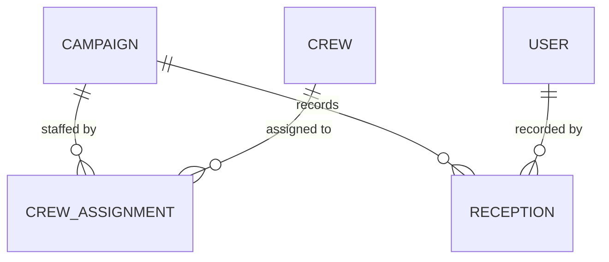

# Data model — <project>

Derived from `docs/knowledge/graph.json`. Every field cites the source that asked for it.
Validated at the `/design-schema` human gate; decisions taken there are recorded at the bottom.

## Entity relationship diagram

Read every line aloud in both directions at the gate. `||--o{` is one-to-many with the many side
optional; `}o--o{` is many-to-many; `||--||` is one-to-one. Getting this wrong is invisible in a
table and obvious in a diagram.

## Entities

### Campaign

Source: `ent-campaign` · discovery call 2026-03-04 L118

| Field | Type | Required | Default | Unique | Indexed | Class | Retention | Source |
| --- | --- | --- | --- | --- | --- | --- | --- | --- |
| `_id` | ObjectId | yes | auto | yes | pk | internal | — | — |
| `campaignName` | string(120) | yes | — | per grower | yes — list filter | internal | life of account | `ent-campaign` L118 |
| `growerId` | ObjectId → Grower | yes | — | no | yes — every list is scoped by it | internal | " | `rel-grower-campaign` |
| `status` | enum `draft\|active\|closed` | yes | `draft` | no | yes — dashboard filter | internal | " | `ent-campaign` L204 |
| `startDate` | date (business day, grower's timezone) | yes | — | no | yes — range query | internal | " | `ent-campaign` L120 |
| `closedAt` | timestamp (UTC instant) | no | — | no | no | internal | " | `proc-campaign-close` |
| `closedBy` | ObjectId → User | no | — | no | no | internal | " | AC-1 of BE-03-02 |

**Lifecycle:** created `draft` → `active` on first crew assignment → `closed` by an administrator.
Reopening is a non-goal (`non-goal-reopen`).
**Delete:** forbidden. Closure is the terminal state; the record is retained for audit.

## Relationships

| From | To | Type | Cardinality | Owner of the reference | Required | On delete | Source |
| --- | --- | --- | --- | --- | --- | --- | --- |
| Grower | Campaign | has-many | 1:N | Campaign holds `growerId` | yes | restrict — a grower with campaigns cannot be deleted | `rel-grower-campaign` |
| Campaign | Crew | staffed-by | M:N via CrewAssignment | join entity | no | cascade the assignment, never the crew | `q-1`, answered 2026-03-11 |

Join entities with their own attributes (`CrewAssignment` carries `assignedOn`, `role`,
`releasedOn`) are listed as full entities above, never hidden inside a relationship row.

## Indexes

| Entity | Index | Serves | Story |
| --- | --- | --- | --- |
| Campaign | `{ growerId: 1, status: 1 }` | the scoped list endpoint, the default view | BE-03-01 |
| Campaign | `{ startDate: -1, _id: -1 }` | date-ordered pagination with a deterministic tie-break | BE-03-01 |
| Reception | `{ campaignId: 1, recordedAt: -1 }` | reception history per campaign | BE-05-02 |

Every index names the query that needs it. An index no story queries is removed; a filter or sort
with no index is a defect found here rather than in production.

## Transactional analysis

| Process | Writes that must be atomic | Volume / frequency | Concurrency | Decision |
| --- | --- | --- | --- | --- |
| `proc-campaign-close` | campaign status + closing of open assignments | tens per week | two admins closing at once | idempotent close; second call is a no-op returning 200 |
| `proc-reception-record` | reception insert + campaign running total | ~2k/day, spikes at harvest | many devices, same campaign | **needs a decision: transaction, or an atomic increment with an eventually-consistent total** |

A row here without a decision is a blocking question for the gate, not a note for later.

## Data classification

| Class | Fields | Handling |
| --- | --- | --- |
| PII | `User.email`, `User.phone`, `Worker.nationalId` | encrypted at rest; never logged; export and deletion paths required by GDPR |
| PHI | — | none in this project |
| Secret | `User.passwordHash`, `ApiKey.hash` | KDF-hashed, never returned by any endpoint, excluded from every projection by default |

## Migration impact

For an existing database: what changes, what backfills, what breaks, and the order of operations.
State explicitly what happens to rows that already exist. A schema change with no migration path is
not finished.

## Decisions taken at the validation gate

| Date | Question | Decision | Rationale | Decided by |
| --- | --- | --- | --- | --- |
| 2026-03-11 | Crew ↔ campaign cardinality | M:N via `CrewAssignment` | crews are shared across concurrent campaigns at peak; confirmed on the 11 March call | client CTO |
